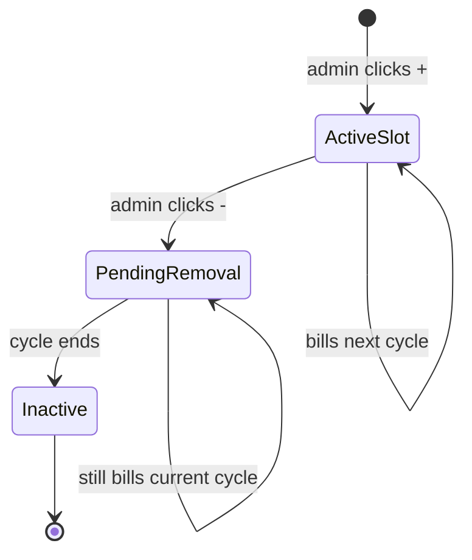

# Billing, Licensing & Usage Tracking

This document describes the end-to-end design of the subscription billing, license-slot allocation, runtime device enforcement, per-user enforcement, API call metering, and transaction tracking subsystems in this project.

---

## 1. Big picture

Three orthogonal concerns, one shared billing engine:

```
┌────────────────────────────┐   ┌────────────────────────────┐   ┌────────────────────────────┐
│  PLAN & SUBSCRIPTION        │   │  RUNTIME ENFORCEMENT        │   │  USAGE METERING             │
│  (what they pay for)        │   │  (who can use it now)       │   │  (what they consumed)       │
│                             │   │                             │   │                             │
│  - Plan catalog             │   │  - Device registrations      │   │  - Per-call API counters    │
│  - Per-app / per-API price  │   │  - User session limits       │   │  - Transaction counts       │
│  - Free tier per row        │   │  - User account limits       │   │  - Aggregated daily         │
│  - Customer-level override  │   │                             │   │                             │
└──────────┬──────────────────┘   └─────────────┬───────────────┘   └──────────────┬──────────────┘
           │                                    │                                  │
           └────────────────┬───────────────────┴──────────────────────────────────┘
                            ▼
                  ┌──────────────────────┐
                  │   BillingService     │
                  │  CalculateEstimate   │
                  │  GenerateInvoice     │
                  └──────────────────────┘
```

Each subsystem is independent. The billing engine reads from all three at month-end (or on-demand) to compute the line items.

---

## 2. Authentication models

Two side-by-side schemes. Pick per endpoint.

### 2.1 JWT (web admin)

- Issued by `POST /api/Auth/login`
- Header: `Authorization: Bearer <jwt>`
- Carries claims: `UserId`, `CustomerId`, role, etc.
- Used by the React web app (`BackOffice.Presentation`)

### 2.2 X-Api-Key (headless apps)

- Header: `X-Api-Key: <Customer.LicenseKey>` (Guid)
- Validated against `dbo.Customers.LicenseKey`
- Used by POS desktop, Back Office desktop, Shipscan mobile, Price Checker mobile, Open API portal
- No per-user identity — only resolves the calling tenant
- Filter: [`ApiKeyAuthFilter.cs`](../BackOffice.Api/Authorization/ApiKeyAuthFilter.cs)

### 2.3 Dev bypass

For local / test environments — appsettings flag `Billing:DevBypassLicenseKey`. When set:
- Requests sending the configured key → real DB write
- Requests sending any other key → fake-success response, no DB write

In production, leave the value empty → bypass disabled, every key validated.

```json
"Billing": {
  "DevBypassLicenseKey": "340778BE-24A2-4FDA-9BC8-A2A19503B6DC"   // dev only
}
```

---

## 3. Database tables

### 3.1 Master DB (`MainDB`)

#### Plans, pricing, subscriptions

| Table | Purpose |
|---|---|
| `dbo.Plans` | Plan catalog (Basic, Pro, Enterprise…) |
| `dbo.PlanAppPricings` | Per-(plan, app) pricing — model, rate, free units, max |
| `dbo.PlanApiPricings` | Per-(plan, api) pricing — rate per call, free tier |
| `dbo.PlanFeatures` | Feature flags per plan |
| `dbo.PlanModules` | Which sidebar modules are visible per plan |
| `dbo.Subscriptions` | Customer ↔ plan link, cycle dates, status |
| `dbo.SubscriptionHistories` | Audit trail of plan changes |

#### Customer-level overrides

| Table | Purpose |
|---|---|
| `dbo.CustomerApps` | Per-customer per-app price/free-tier override |
| `dbo.CustomerApiOverrides` | Per-customer per-api rate/free-tier override |

#### Apps & APIs catalogs

| Table | Purpose |
|---|---|
| `dbo.Apps` | App definitions (Web App, POS Terminals, Picking Devices, Price Checkers, Back Office) |
| `dbo.ApiDefinitions` | Metered API definitions (CUSTOMER_SYNC, ITEM_SYNC, PHONE_ORDER, CUSTOMER_CREATE) |

#### License slots & device registry

| Table | Purpose |
|---|---|
| `dbo.CustomerAppLicenses` | One row per device-slot the customer paid for |
| `dbo.CustomerDevices` | One row per registered physical device or browser fingerprint |

#### Usage logs

| Table | Purpose |
|---|---|
| `dbo.ApiUsageLogs` | Daily per-(customer, api) call counts |
| `dbo.UsageRecords` | Per-(customer, app, metric) counts (transactions, etc.) |

#### Invoicing

| Table | Purpose |
|---|---|
| `dbo.Invoices` | Generated invoices |
| `dbo.InvoiceLineItems` | Each charge line on an invoice |
| `dbo.PaymentAttempts` | Payment provider attempts per invoice |
| `dbo.BillingConfigs` | Global tunables (tax rate, transaction rate, free tier, dev key) |

#### Auth & users

| Table | Purpose |
|---|---|
| `dbo.AppUsers` | User accounts (master DB; `Status=1` is active) |
| `dbo.UserSessions` | Active session records (one per logged-in user per customer) |
| `dbo.Customers` | Tenants (`LicenseKey` Guid for X-Api-Key auth) |

#### Permissions registry (master)

| Table | Purpose |
|---|---|
| `dbo.Modules`, `dbo.Screens`, `dbo.Permissions` | Catalog auto-seeded from `Perms.cs` |
| `dbo.TenantAllowedPermissions` | Which permissions a tenant can use (ceiling) |

### 3.2 Tenant DB (per customer)

| Table | Purpose |
|---|---|
| `dbo.RbacTenantRoles` | Roles defined in this tenant |
| `dbo.RbacTenantUserRoles` | Which user has which role |
| `dbo.RbacTenantRolePermissions` | Permission grants per role (key → allowed) |
| `dbo.RbacTenantUserPermOverride` | Per-user permission overrides |

### 3.3 Key columns reference

#### `dbo.CustomerAppLicenses`

| Column | Type | Notes |
|---|---|---|
| `Id` | `INT IDENTITY` | PK |
| `CustomerId` | `INT` | FK → Customers |
| `AppId` | `INT` | Logical FK → Apps (no DB constraint) |
| `DeviceLabel` | `NVARCHAR(200)` | Optional human label |
| `ActivatedAt` | `DATE` | When the slot was added |
| `BillingEndsAt` | `DATE NULL` | End-of-cycle date when removal kicks in. NULL = active. |
| `RemovalRequestedAt` | `DATE NULL` | When admin clicked "remove" |
| `CreatedBy`, `RemovedBy` | `INT NULL` | UserId audit |
| `CreatedAt` | `DATETIME2` | Insertion time |

#### `dbo.CustomerDevices`

| Column | Type | Notes |
|---|---|---|
| `DeviceId` | `INT IDENTITY` | PK |
| `CustomerId` | `INT` | FK → Customers |
| `AppId` | `INT NULL` | Logical FK → Apps |
| `AdvancedUId` | `NVARCHAR(255)` | Stable device fingerprint (must be unique per device) |
| `DeviceName` | `NVARCHAR` | Human-readable name |
| `LastLoginDate` | `DATETIME` | Last heartbeat (drives the inactive-window check) |
| `DateCreated` | `DATETIME` | First registration |
| `DateModified` | `DATETIME` | Last update |
| `LicenseId` | `INT NULL` | FK → `CustomerAppLicenses(Id)` — the slot this device claimed |

#### `dbo.ApiUsageLogs`

| Column | Type | Notes |
|---|---|---|
| `Id` | `INT IDENTITY` | PK |
| `CustomerId` | `INT` | FK → Customers |
| `ApiDefinitionId` | `INT` | FK → ApiDefinitions |
| `RecordedDate` | `DATE` | Daily granularity |
| `CallCount` | `INT` | Increments on upsert |
| `BillingPeriodStart`, `BillingPeriodEnd` | `DATE` | Cycle window the log belongs to |
| `CreatedAt`, `UpdatedAt` | `DATETIME2` | Audit |

#### `dbo.ApiDefinitions`

| Column | Type | Notes |
|---|---|---|
| `Id` | `INT IDENTITY` | PK |
| `Code` | `NVARCHAR(50)` | Stable code (`CUSTOMER_SYNC`, `ITEM_SYNC`, `PHONE_ORDER`, `CUSTOMER_CREATE`) |
| `Name` | `NVARCHAR(200)` | Display name |
| `DefaultRatePerCall` | `DECIMAL(10,4)` | Used as fallback for new plan rows |
| `DefaultFreeTier` | `INT` | Default 250 |
| `IsActive` | `BIT` | Soft delete |

---

## 4. Plan and subscription flow

### 4.1 Choosing a plan

```
Super-admin                                    Tenant admin
   │                                                │
   ├── Creates plan                                  │
   │     dbo.Plans                                   │
   │     dbo.PlanAppPricings  (price, free, max)     │
   │     dbo.PlanApiPricings  (rate, free tier)      │
   │     dbo.PlanFeatures                            │
   │     dbo.PlanModules                             │
   │                                                 │
   ├── Assigns plan to customer ─────────────────▶ Receives plan
   │     dbo.Subscriptions  (CustomerId, PlanId)     │     in /licenses-billing UI
   │     dbo.SubscriptionHistories  (audit)          │
   │                                                 ▼
   │                                          Self-serve change?
   │                                            (admin.licenses_billing.edit
   │                                             permission)
   │                                                 │
   │                                                 ▼
   ◀───────── POST /api/Subscription/Change ─────────┤
                       │
                       ▼
              Updates Subscription
              + writes SubscriptionHistory row
```

### 4.2 Cycle math (matches `BillingService.CalculateEstimatedBillAsync`)

```
billingPeriodStart = subscription.StartDate
billingPeriodEnd   = billingPeriodStart + BillingCycleMonths months

while (billingPeriodEnd <= now)
    billingPeriodStart = billingPeriodEnd
    billingPeriodEnd   = billingPeriodStart + BillingCycleMonths months
```

This rolls forward from the subscription start to the current cycle.

---

## 5. License slots — pay-per-device model

### 5.1 Concept

A "slot" is one device-equivalent the customer is paying for. Adding a slot mid-cycle is prorated (fewer days = less charge). Removing a slot doesn't refund — it just stops billing in the next cycle.

### 5.2 Lifecycle



### 5.3 Add / remove flow

```
Customer admin clicks +
        │
        ▼
POST /api/CustomerAppLicense/Mine/Add  body: { appId }
        │
        ▼
Inserts row:
  ActivatedAt = today
  BillingEndsAt = NULL

Bill on next estimate:
  prorated = (cycleEnd - today) / cycleDays × pricePerUnit
```

```
Customer admin clicks - (LIFO — most recent first)
        │
        ▼
DELETE /api/CustomerAppLicense/Mine/{id}
        │
        ▼
Updates the row:
  BillingEndsAt = endOfCurrentCycle
  RemovalRequestedAt = today

Current cycle still bills full
Next cycle excludes the slot
```

### 5.4 Device-days proration math

```
For each plan-included app:
  totalDeviceDays = Σ over slots:
      effStart = max(ActivatedAt, periodStart)
      effEnd   = min(BillingEndsAt ?? periodEnd, periodEnd)
      span     = max(0, effEnd - effStart)

  freeDeviceDays    = freeUnits × periodDays
  billableDays      = max(0, totalDeviceDays − freeDeviceDays)
  billableUnits     = billableDays / periodDays           (decimal)
  lineTotal         = billableUnits × pricePerUnit        (rounded 2dp)
```

Code: [`BillingService.cs`](../BackOffice.Persistence/Services/Main/BillingService.cs).

### 5.5 UI — Licenses & Billing page

`+`/`−` counters, batched save, prorated preview, removal confirm modal. Permission gates:
- Page visible: `admin.licenses_billing.view`
- Plan change button: `admin.licenses_billing.edit`
- License +/-: `admin.licenses_billing.edit`

Code: [`LicensesAndBillingPage.tsx`](../BackOffice.Presentation/src/pages/LicensesAndBillingPage.tsx).

---

## 6. Per-device runtime enforcement

### 6.1 Apps that participate

| App | `appId` | Pricing model | Auth method |
|---|---|---|---|
| Web App | 1 | per_user | (skip — uses login + user creation checks instead) |
| POS Terminals | 2 | per_device | X-Api-Key |
| Picking Devices (Shipscan) | 3 | per_device | X-Api-Key |
| Price Checkers | 4 | per_device | X-Api-Key |
| Back Office (Desktop) | 5 | per_device | X-Api-Key |

### 6.2 Registration / heartbeat flow

```
Desktop / mobile app on startup
        │
        ▼
POST /api/DeviceLicense/Register
  X-Api-Key: <customer's LicenseKey>
  body: { appId, advancedUId, deviceName }
        │
        ▼
ApiKeyAuthFilter resolves Customer
        │
        ▼
UsageTrackingService.RegisterDeviceAsync
        │
   ┌────┴───────────────────────────────────┐
   │                                        │
   ▼                                        ▼
 Existing fingerprint?                    New fingerprint?
   │                                        │
   ▼                                        ▼
 Update LastLoginDate                  Count active devices vs slots
 Return Allowed=true                    │
                                        ▼
                                   slotsUsed >= slotsTotal?
                                   ┌────┴─────┐
                                  YES         NO
                                   │           │
                                   ▼           ▼
                            Allowed=false   Insert CustomerDevices row
                            reason = "..."  Claim oldest free CustomerAppLicenses slot
                                            Return Allowed=true
```

### 6.3 Decision logic in the client

```
result = await api.RegisterDevice(...)

if (!result.allowed):
    showBlockingDialog(result.reason)
    exit()

scheduleHeartbeat(every 15 min, same call)
```

Heartbeat failures (network blips) are silently retried; only `allowed=false` from the server triggers `onLicenseLost`.

### 6.4 Inactive-window cleanup

Devices that haven't sent a heartbeat for `device_inactive_days` (default 30, in `BillingConfigs`) are excluded from the "active devices" count, freeing their slot for new registrations. No explicit removal needed — the count just drops.

### 6.5 Endpoints

| Endpoint | Auth | Purpose |
|---|---|---|
| `POST /api/DeviceLicense/Register` | X-Api-Key | Register / heartbeat |
| `GET /api/DeviceLicense/Limit/{appId}` | X-Api-Key | Read-only slot count |
| `POST /api/Usage/RegisterDevice` | JWT | Same logic, web-admin path |
| `GET /api/Usage/MyDeviceLimit/{appId}` | JWT | Web-admin |
| `GET /api/Usage/MyDeviceLimits` | JWT | Web-admin (all apps) |

---

## 7. Web App per-user enforcement

Two independent layers, both active:

### 7.1 Strategy A — login (active sessions)

```
POST /api/Auth/login
        │
        ▼
AppUserService.AuthenticateAsync (validates credentials)
        │
        ▼
CHECK 1: environment access
CHECK 2: existing-session conflict
CHECK 3: legacy MaxConcurrentUsers cap
        │
        ▼
CHECK 3.5 (NEW): UsageTrackingService.CheckWebAppSeatAsync
  slotsTotal = Web App CustomerAppLicenses count
  slotsUsed  = active UserSessions count
  alreadySeated = does this user already have an active session?
        │
   ┌────┴──────┐
  pass        fail
   │           │
   ▼           ▼
 CHECK 4    Return 401 web_seat_limit
 ...
```

If `slotsTotal == 0` → unlimited, the check passes everyone.

Re-logins by an already-seated user always pass — no double-counting.

### 7.2 Strategy B — user creation (account count)

```
POST /api/User/CreateUser  (admin action)
        │
        ▼
UserManagementService.CreateUserAsync
        │
        ▼
CheckWebAppUserLimitAsync
  slotsTotal = Web App CustomerAppLicenses count
  usersUsed  = AppUsers count where Status=1 for this customer
        │
   ┌────┴──────┐
  pass        fail
   │           │
   ▼           ▼
 Insert      Return 400
 AppUser     "User limit reached (10/10)"
 + tenant
 user row
```

If `slotsTotal == 0` → unlimited.

Soft-deleted users (`Status = 0`) don't consume a seat, so deactivation frees the count.

### 7.3 Why both?

- Strategy A handles the case where users exist but the customer wants to cap concurrent Web App sessions
- Strategy B prevents creating accounts beyond the paid limit
- Today both are mapped to the same Web App slot count — they enforce the same limit at different gates. If you ever split "max users" from "max concurrent" into two plan fields, the two strategies become independent checks.

---

## 8. API call metering

### 8.1 ApiDefinitions catalog

Pre-seeded codes:

| Id | Code | Name |
|---|---|---|
| 1 | `ITEM_SYNC` | Item Sync API |
| 2 | `CUSTOMER_SYNC` | Customer Sync API |
| 3 | `PHONE_ORDER` | Create Phone Order API |
| 4 | `CUSTOMER_CREATE` | Customer Create API |

To add another: `INSERT INTO dbo.ApiDefinitions (Code, Name, ...) VALUES (...)` then `[MeterApiCall("NEW_CODE")]` on whichever endpoint.

### 8.2 Two ways to record

#### A. In-process (this project's controllers)

```csharp
[HttpPost("Sync")]
[MeterApiCall("CUSTOMER_SYNC")]
public async Task<IActionResult> SyncCustomers(...)
{
    return Ok(await _service.SyncAsync(...));
}
```

The `MeterApiCallFilter` runs after the action. On 2xx, it records one row in `dbo.ApiUsageLogs` for the customer. Failures don't bill.

#### B. From an external project (Open API portal)

```http
POST /api/Usage/RecordApiCall
X-Api-Key: <customer's LicenseKey>

{ "apiDefinitionId": 4, "callCount": 1 }
```

The endpoint resolves `CustomerId` from the X-Api-Key (it's overridden on the server — the body's `customerId` is ignored). Records one row in `dbo.ApiUsageLogs`.

### 8.3 Recording rules

- Record only on HTTP 2xx
- Skip when no tenant context (super-admin / unauthenticated)
- Skip if the `Code` doesn't match an active `ApiDefinitions` row (logs a warning)
- Recording errors are logged at WARN, never propagated — billing loss > user-visible failure

### 8.4 Daily upsert pattern

```
existing = SELECT FROM ApiUsageLogs
  WHERE CustomerId = @c AND ApiDefinitionId = @d AND RecordedDate = today

IF existing → existing.CallCount += @count
ELSE        → INSERT (CustomerId, ApiDefinitionId, RecordedDate=today, CallCount=@count)
```

One row per (customer, api, day). Multiple hits on the same day increment.

### 8.5 Free tier in the bill

```
For each plan-included api:
  totalCalls = Σ ApiUsageLogs.CallCount in cycle
  rate       = CustomerApiOverride?.RateOverride    ?? planApi.RatePerCall
  freeTier   = CustomerApiOverride?.FreeTierOverride ?? planApi.FreeTierCalls
  billable   = max(0, totalCalls − freeTier)
  lineTotal  = billable × rate
```

---

## 9. Transactions

### 9.1 Recording

POS / sale-completion code calls:

```http
POST /api/Usage/Record
X-Api-Key: <customer's LicenseKey>

{ "appId": <pos>, "metricType": "transaction", "count": 1 }
```

Service upserts `dbo.UsageRecords` for `(customerId, appId, metricType, recordedDate=today)`.

### 9.2 Billing

`BillingService` reads `UsageRecords` where `MetricType='transaction'`, sums for the cycle, applies free tier and rate from `BillingConfigs`:

| BillingConfig key | Default | Purpose |
|---|---|---|
| `transaction_rate` | 0 | $ per billable transaction |
| `transaction_free_tier` | 0 | First N transactions free per cycle |

Currently flat (not per-plan). To make it per-plan, add `TransactionRate` / `TransactionFreeTier` to `dbo.Plans` or a new `PlanTransactionPricing` table.

---

## 10. Estimated bill calculation

The full bill assembly (`BillingService.CalculateEstimatedBillAsync`):

```
1. Load Customer.Subscription.Plan → planId, BillingCycleMonths
2. Compute current cycle [periodStart, periodEnd)
3. Load:
   - PlanAppPricings (IsIncluded=true)
   - PlanApiPricings (IsIncluded=true)
   - CustomerApps (per-app overrides)
   - CustomerApiOverrides
   - CustomerAppLicenses (active + pending-removal in cycle)
   - ApiUsageLogs in cycle
   - UsageRecords with MetricType='transaction' in cycle
   - BillingConfigs

4. For each plan-included App:
     compute device-days from CustomerAppLicenses
     apply free tier
     line += billableUnits × pricePerUnit

5. For each plan-included Api:
     sum ApiUsageLogs.CallCount in cycle
     apply free tier
     line += billable × rate

6. transaction count from UsageRecords
   apply free tier
   line += billable × rate

7. SubTotal = Σ line totals
   TaxAmount = SubTotal × (default_tax_rate / 100)
   Total = SubTotal + TaxAmount
```

Output → `EstimatedBillDto` with line items and total. Frontend displays in the Estimated Bill panel.

---

## 11. Permissions

### 11.1 Hybrid model

- **Master DB** has the catalog: `dbo.Modules`, `dbo.Screens`, `dbo.Permissions`, `dbo.TenantAllowedPermissions`
- **Tenant DB** has the grants: `dbo.RbacTenantRolePermissions`, `dbo.RbacTenantUserPermOverride`
- `[RequirePermission("key")]` on a controller looks up the user's effective permissions = master catalog ∩ tenant-allowed ∩ role-grants

### 11.2 Auto-seeding

`PermissionRegistryService.SeedPermissionsAsync()` reflects over the static `Perms` class on app startup and inserts any missing rows into `dbo.Permissions`. Adding a new permission key = adding a `const string` to `Perms.cs`.

### 11.3 Keys for this subsystem

| Key | Purpose |
|---|---|
| `admin.licenses_billing.view` | View the Licenses & Billing page |
| `admin.licenses_billing.edit` | Change plan, add/remove licenses |

Granting on tenant DB: `dbo.RbacTenantRolePermissions` (RoleId, PermissionKey, IsGranted=1) — see [`20260501_GrantLicensesBillingToAdminRoles.sql`](../Scripts/MainDB/20260501_GrantLicensesBillingToAdminRoles.sql).

---

## 12. Frontend

### 12.1 Licenses & Billing page

[`LicensesAndBillingPage.tsx`](../BackOffice.Presentation/src/pages/LicensesAndBillingPage.tsx)

Sections:
- **Stat cards** — plan name, license total, API total, base plan, transactions
- **Current Plan** — name, status, included apps + APIs, change-plan button
- **Device Licenses** — one row per app, +/− counters, prorated preview, save/discard
- **Estimated Bill** — line items + total
- **API Usage** — per-API call counts, free-tier display
- **Transactions** — total / free / billable
- **Invoice History** — past invoices

API calls: [`billingService.ts`](../BackOffice.Presentation/src/services/billingService.ts).

### 12.2 Change Plan modal

Plan grid with Upgrade / Downgrade / Current state per tier. Confirms before submitting `POST /api/Subscription/Change`.

### 12.3 Edit Plan (super-admin)

[`PlanManagementPage`](../BackOffice.Presentation/src/pages/SuperAdmin/) → Edit Plan modal with three tabs:
- **App Pricings** — per (plan, app) row: model, price/unit, free units, max units, included flag
- **API Pricings** — per (plan, api) row: rate per call, free tier calls
- **Features** — feature flags

---

## 13. Migration scripts

Run in order against MainDB:

| # | Script | Purpose |
|---|---|---|
| 1 | `20260318_Billing_Schema_And_Seed.sql` | Initial billing schema + seed apps & APIs (existing) |
| 2 | `20260318_Add_LicensesBilling_Screens.sql` | Existing — adds the L&B screen + permissions catalog |
| 3 | `20260501_CreateCustomerAppLicenses.sql` | Creates the slot table; widens `InvoiceLineItems.BillableUnits` to `decimal(18,4)` |
| 4 | `20260501_SeedApps_LicensesBilling.sql` | Renames AppIds 1→Web App, 2→POS Terminals; inserts 3 = Picking, 4 = Price Checker |
| 5 | `20260501_AddBackOfficeApp.sql` | Inserts AppId 5 = Back Office (Desktop App) |
| 6 | `20260501_DeviceRegistrationLink.sql` | Adds `CustomerDevices.LicenseId` FK + `device_inactive_days` config; resizes `AdvancedUId` to NVARCHAR(255); creates lookup index |
| 7 | `20260502_SeedFourApis_AndPlanPricing.sql` | Adds CUSTOMER_CREATE; backfills per-plan pricing rows for all 4 APIs |

Per-tenant DB (run on each tenant DB after the master scripts):

| # | Script | Purpose |
|---|---|---|
| T1 | `20260501_GrantLicensesBillingToAdminRoles.sql` | Grants `admin.licenses_billing.{view,edit}` to admin/system roles |

---

## 14. Endpoint reference

### 14.1 Subscription / plan

| Method | Path | Auth | Purpose |
|---|---|---|---|
| GET | `/api/Subscription/MySubscription` | JWT | My current plan |
| GET | `/api/Subscription/Customer/{id}` | JWT | (super-admin) any customer |
| POST | `/api/Subscription/Change` | JWT + `admin.licenses_billing.edit` | Change plan |
| GET | `/api/Plan/Lookup` | JWT | Plan catalog |
| GET | `/api/PlanPricing/Plan/{id}` | JWT | Plan detail (apps, apis, features) |

### 14.2 License slots

| Method | Path | Auth | Purpose |
|---|---|---|---|
| GET | `/api/CustomerAppLicense/Mine?includeRemoved=` | JWT + view | List my slots |
| GET | `/api/CustomerAppLicense/MySummary` | JWT + view | Aggregated counts per app |
| POST | `/api/CustomerAppLicense/Mine/Add` | JWT + edit | Add a slot |
| DELETE | `/api/CustomerAppLicense/Mine/{id}` | JWT + edit | Request removal |

### 14.3 Device registration

| Method | Path | Auth | Purpose |
|---|---|---|---|
| POST | `/api/DeviceLicense/Register` | X-Api-Key | Register / heartbeat |
| GET | `/api/DeviceLicense/Limit/{appId}` | X-Api-Key | Read-only slot count |
| POST | `/api/Usage/RegisterDevice` | JWT | Same logic, web admin |
| GET | `/api/Usage/MyDeviceLimit/{appId}` | JWT | Web admin |
| GET | `/api/Usage/MyDeviceLimits` | JWT | Web admin (all apps) |

### 14.4 Usage recording

| Method | Path | Auth | Purpose |
|---|---|---|---|
| POST | `/api/Usage/RecordApiCall` | X-Api-Key | Record an API call |
| POST | `/api/Usage/Record` | X-Api-Key | Record a transaction or other metric |

### 14.5 Dashboards

| Method | Path | Auth | Purpose |
|---|---|---|---|
| GET | `/api/Billing/MyEstimate` | JWT | Estimated bill for the cycle |
| GET | `/api/Billing/MyStatus` | JWT | Subscription health |
| GET | `/api/Billing/MyInvoices` | JWT | Invoice list |
| GET | `/api/Billing/Invoice/{id}` | JWT | Invoice detail |
| GET | `/api/Usage/MyUsage` | JWT | My usage dashboard |

### 14.6 Auth

| Method | Path | Auth | Purpose |
|---|---|---|---|
| POST | `/api/Auth/login` | none | Login (JWT issued; CHECK 3.5 enforces Web App seat) |
| POST | `/api/Auth/confirm-login` | none | Resolve session conflict |
| POST | `/api/User/CreateUser` | JWT | Create user (Strategy B enforces user limit) |

---

## 15. Configuration

### 15.1 appsettings keys

| Key | Default | Purpose |
|---|---|---|
| `ConnectionStrings:DefaultConnection` | env-specific | MainDB connection |
| `Billing:DevBypassLicenseKey` | empty | Dev-only X-Api-Key bypass (set in Development, empty in Production) |

### 15.2 BillingConfigs rows

| ConfigKey | Default | Purpose |
|---|---|---|
| `default_tax_rate` | 0 | Tax % applied to subtotal |
| `transaction_rate` | 0 | $ per billable transaction |
| `transaction_free_tier` | 0 | Free transactions per cycle |
| `device_inactive_days` | 30 | Days before a device frees its slot |
| `invoice_prefix` | "INV" | Prefix for generated invoice numbers |

---

## 16. Testing

### 16.1 Slot allocation (Strategy A — frontend)

1. Open Licenses & Billing as a customer admin
2. Click `+` on POS row → expect "+1 new (prorated $X for N days remaining)"
3. Save → verify `dbo.CustomerAppLicenses` has new row, `BillingEndsAt = NULL`
4. Click `−` → confirm modal → save → verify row has `BillingEndsAt = endOfCycle`

### 16.2 Device registration

```bash
KEY="340778BE-24A2-4FDA-9BC8-A2A19503B6DC"
URL="https://localhost:5041/api/DeviceLicense/Register"

curl -X POST "$URL" -H "X-Api-Key: $KEY" -H "Content-Type: application/json" \
  -d '{"appId":3,"advancedUId":"PICKING-FP-002","deviceName":"Picking Device 2"}'
# expect: allowed=true, isNewDevice=true

curl -X POST "$URL" -H "X-Api-Key: $KEY" -H "Content-Type: application/json" \
  -d '{"appId":3,"advancedUId":"PICKING-FP-002","deviceName":"Picking Device 2"}'
# expect: allowed=true, isNewDevice=false (heartbeat)

# Fill all slots, then try one more
curl -X POST "$URL" -H "X-Api-Key: $KEY" -H "Content-Type: application/json" \
  -d '{"appId":3,"advancedUId":"PICKING-FP-999","deviceName":"Over Limit"}'
# expect: allowed=false, reason="License limit reached"
```

### 16.3 Web App seat (Strategy A — login)

1. Allocate exactly 1 Web App slot
2. Log in as user A → succeeds
3. Log in as user B → 401 `web_seat_limit`
4. Log out user A → user B login succeeds

### 16.4 Web App user creation (Strategy B)

1. Allocate exactly 2 Web App slots
2. Create users 1 and 2 → succeed
3. Create user 3 → 400 "Web App user limit reached (2/2)"
4. Soft-delete user 2 (`Status=0`) → user 3 creation succeeds

### 16.5 API call metering

1. Add `[MeterApiCall("CUSTOMER_SYNC")]` to a controller method
2. Hit it → check `SELECT * FROM dbo.ApiUsageLogs ORDER BY UpdatedAt DESC` — see `CallCount=1` for today
3. Hit again → same row, `CallCount=2`
4. Refresh `/api/Billing/MyEstimate` → API line item reflects calls × rate (after free tier subtraction)

### 16.6 Useful debug SQL

```sql
SELECT 'Slots' AS Kind, COUNT(*) FROM dbo.CustomerAppLicenses
WHERE CustomerId = @c AND AppId = @a AND BillingEndsAt IS NULL
UNION ALL
SELECT 'Active Devices', COUNT(*) FROM dbo.CustomerDevices
WHERE CustomerId = @c AND AppId = @a AND LastLoginDate >= DATEADD(DAY, -30, SYSUTCDATETIME());

SELECT TOP 10 d.DeviceId, d.AdvancedUId, d.DeviceName, d.LastLoginDate, d.LicenseId
FROM dbo.CustomerDevices d
WHERE d.CustomerId = @c AND d.AppId = @a
ORDER BY d.DateModified DESC;

SELECT aul.RecordedDate, ad.Code, aul.CallCount
FROM dbo.ApiUsageLogs aul
INNER JOIN dbo.ApiDefinitions ad ON ad.Id = aul.ApiDefinitionId
WHERE aul.CustomerId = @c
ORDER BY aul.RecordedDate DESC, ad.Code;
```

---

## 17. Roadmap / known gaps

| Item | Status | Notes |
|---|---|---|
| Hard enforcement in desktop apps | Pending | Apps must call `RegisterDevice` and respect `allowed=false` |
| Frontend toast on `web_seat_limit` 401 | Pending | LoginPage error handler tweak |
| Per-plan transaction rate | Pending | Currently flat in `BillingConfigs`. Needs schema change. |
| Device removal (broken / stolen) | Pending | Soft-delete with reason + stolen-fingerprint blacklist |
| Auto-seed `ApiDefinitions` from a `Codes` static class | Pending | Currently insert-by-hand. Mirror the `Perms` reflection pattern. |
| Race window: Login OK → MFA verify → slot consumed | Pending | Re-check seat inside `CreateSessionAndTokens` |
| Permission gate on `/api/Usage/Record*` | Optional | Already authenticated by X-Api-Key; add only for service-account distinction |

---

## 18. Code map

| File | Role |
|---|---|
| [`BillingService.cs`](../BackOffice.Persistence/Services/Main/BillingService.cs) | Estimated bill, invoice generation |
| [`UsageTrackingService.cs`](../BackOffice.Persistence/Services/Main/UsageTrackingService.cs) | RegisterDevice, CheckWebAppSeat, CheckWebAppUserLimit, RecordApiCall |
| [`CustomerAppLicenseService.cs`](../BackOffice.Persistence/Services/Main/CustomerAppLicenseService.cs) | Slot add / remove / list |
| [`SubscriptionService.cs`](../BackOffice.Persistence/Services/Main/SubscriptionService.cs) | Change plan, suspend, reactivate |
| [`UserManagementService.cs`](../BackOffice.Persistence/Services/Tenant/UserManagementService.cs) | Create user (Strategy B) |
| [`AuthController.cs`](../BackOffice.Api/Controllers/AuthController.cs) | Login (Strategy A) |
| [`UsageController.cs`](../BackOffice.Api/Controllers/UsageController.cs) | All Usage endpoints |
| [`DeviceLicenseController.cs`](../BackOffice.Api/Controllers/DeviceLicenseController.cs) | X-Api-Key device endpoints |
| [`CustomerAppLicenseController.cs`](../BackOffice.Api/Controllers/CustomerAppLicenseController.cs) | Slot management endpoints |
| [`ApiKeyAuthFilter.cs`](../BackOffice.Api/Authorization/ApiKeyAuthFilter.cs) | X-Api-Key auth |
| [`MeterApiCallFilter.cs`](../BackOffice.Api/Authorization/MeterApiCallFilter.cs) | `[MeterApiCall]` recording |
| [`LicenseClient.cs`](../ClientIntegration/LicenseClient.cs) | Reference C# client for desktop apps |
